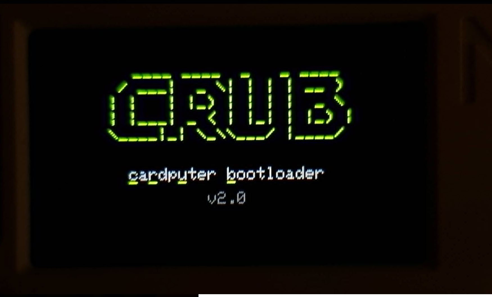
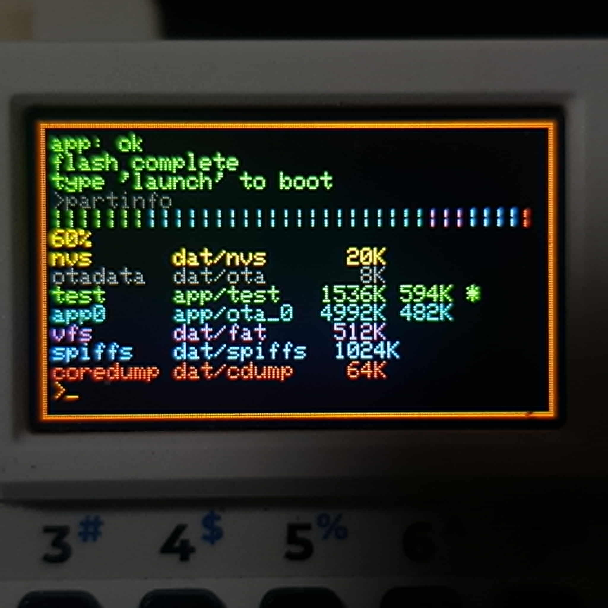
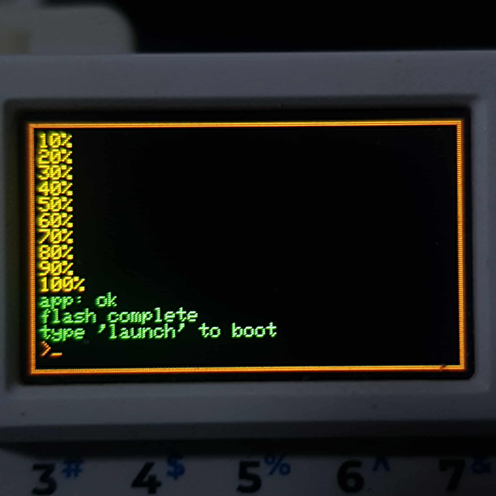
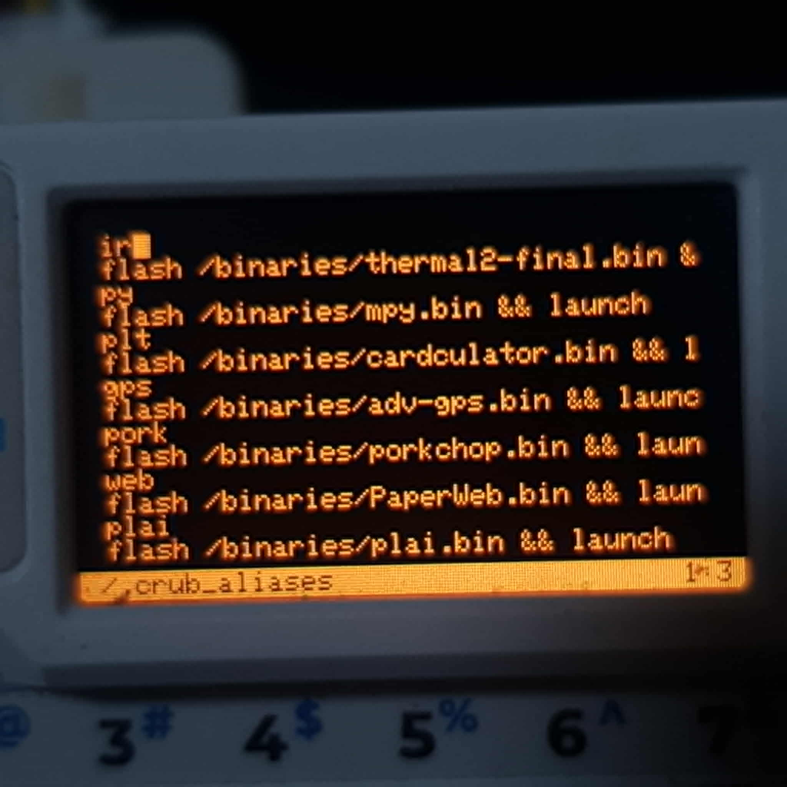
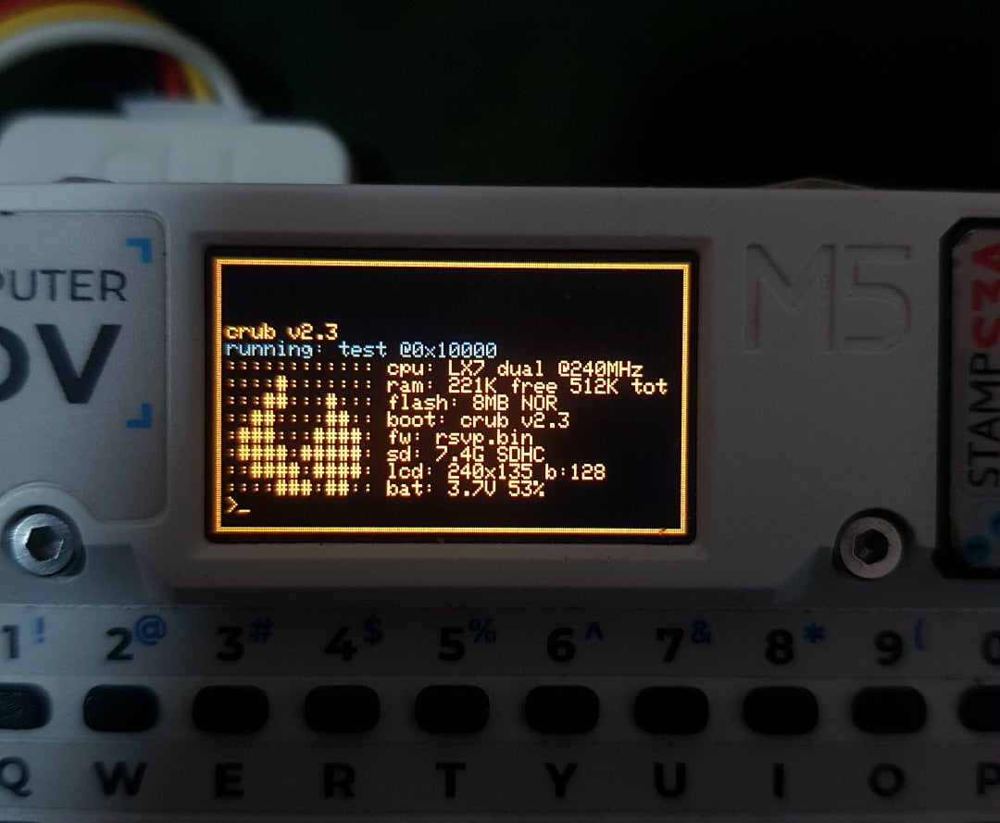
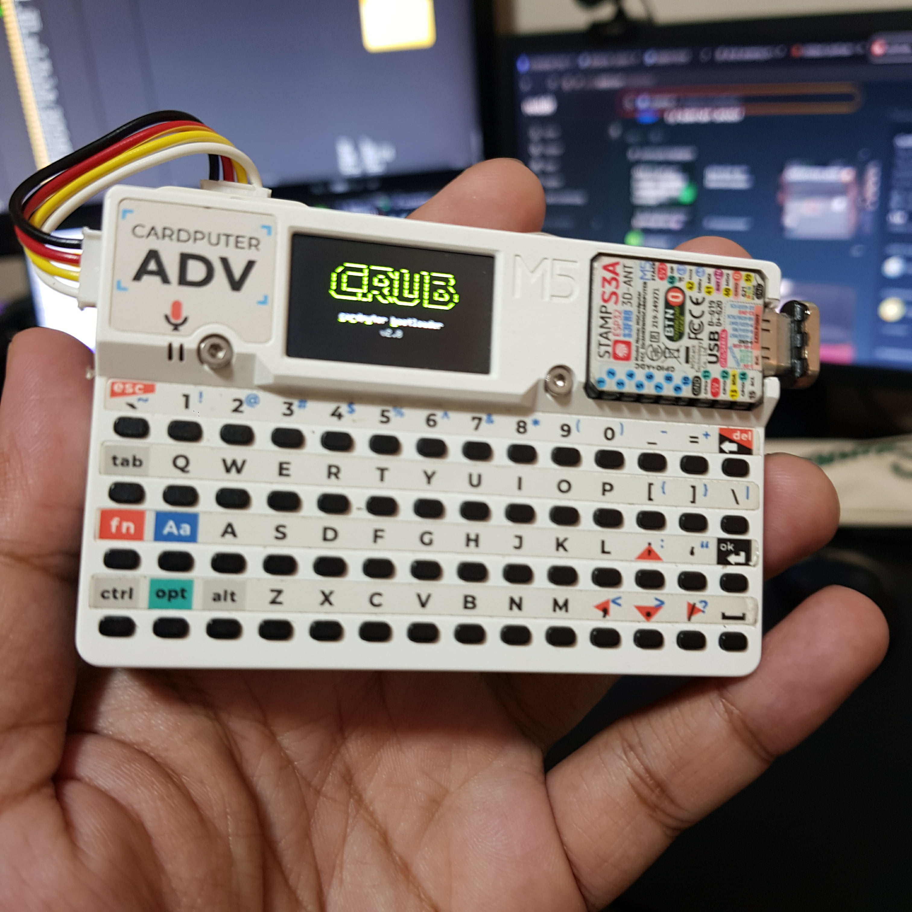

# crub
---

A lightweight bootloader/firmware flasher for M5Cardputer ADV with disk partition management and a UNIX-like file manager.

---

boot screen



partition info



running `flash binary.bin`



editor



fetch



overall




---

## Building

```
git clone https://github.com/wisnc/crub
cd crub
pio run -e bootloader
pio run -e m5cardputer
```

## Installing

Since this is a merged firmware, you need to use `esptool`.

```bash
python -m esptool --chip esp32s3 --port <COM PORT> --baud 1500000 --before default_reset --after hard_reset write_flash -z 0x0 .pio\build\bootloader\bootloader.bin 0x8000 .pio\build\m5cardputer\partitions.bin 0x10000 .pio\build\m5cardputer\firmware.bin
```

make sure to replace `<COM PORT>` with your cardputer serial port.

## How to use

flash binaries from SD with
```
flash /path/to/binary.bin
```

then launch it with

```
launch
```

aliases can be externally edited (or with the built in editor) and is located as a text file in

```
/.crub/aliases
```


create aliases for flashing and launch: e.g. shortcut flash and launch bruce as "br"

```
alias br "flash /binaries/bruce.bin && launch"
```

view binary partition scheme

```
pt info /path/to/binary.bin
```

run scripts from SD

```
run /path/to/script.sh
```

scripts are just text files with one command per line. lines starting with `#` are comments. you can use `echo`, `sleep`, and any other crub command inside them. output redirection works with `>` and `>>`

```
echo hello > /notes/test.txt
echo second line >> /notes/test.txt
ls /binaries > /logs/filelist.txt
```

boot scripts run automatically if `/.crub/boot` exists on the SD card. the boot screen itself is just a command, `boots <ms>`, so the default boot script is

```
boots 1500
fetch
```

delete the `boots` line to skip the splash, change the number to adjust how long it shows, or replace everything with `launch -f` for instant firmware boot

for waiting in scripts, `waits <seconds>` and `waitms <milliseconds>` are also available alongside `sleep`

### boot screen

drop a bmp at `/.crub/bootscreen.bmp` and `boots` will show it instead of the built in logo. it has to be exactly 240x135.

convert and scale any image with ffmpeg. example below

```
ffmpeg -i input.png -vf scale=240:135:flags=lanczos -pix_fmt bgr24 bootscreen.bmp
```

if the source is not 16:9 that command stretches it. to crop to fill instead

```
ffmpeg -i input.png -vf "scale=240:135:force_original_aspect_ratio=increase:flags=lanczos,crop=240:135" -pix_fmt bgr24 bootscreen.bmp
```

### customizing fetch

fetch can be reconfigured without touching code. pick which fields show and in what order

```
fetch fields cpu ram bat uptime mac temp
```

available fields are cpu, ram, flash, boot, fw, sd, lcd, bat, uptime, mac, and temp. `fetch fields reset` restores the default set

change the ascii art with any file, or edit it directly in the editor

```
fetch logo /path/to/art.txt
fetch edit
```

`fetch logo reset` restores the built in logo. fetch config lives in `/.crub/`

### crub fix

all crub config lives under a single `/.crub/` directory. run `crub fix` to move any old loose config files into it and create missing defaults

### Themes!

on boot, a `/.crub/theme` is created which contains the default theme of crub, edit it with the editor. you are also able to use .bmp files as a background for the console, make sure it is also 240x135.

```
color primary 00D0FF
color border 0080FF
color info FFFFFF
color ok 00FF88
color warn FFD000
color error FF4040

background <file.bmp>
blur on|off
bgtrans <0-255>
```


these are the default values for the theme and can be found on the `/.crub/theme` file.

### fast firmware boot

write `launch -f` to `/.crub/boot` and crub will skip the boot screen and launch installed firmware instantly on power on. remove the SD card to enter crub normally

```
echo launch -f > /.crub/boot
```


### calculations

you can also quickly do calculations. start the expression with '='. for example

```
>=5*3
15
>=2.5*(3+1)
10
>=100/3
33.3333
>=17%5
2
>=(2+3)*(7-1)
30
```

commands can be viewed with `help`

display can also be controlled with `bright <0-255>`, Fn + _ and Fn + = for dimmer and brighter display. also Btn0 toggles display to save battery

### editor

`edit (filename)` to enter nano-like editor

`Fn + , . / ;` for left down right up

`Fn + backspace` for exit/save. moves to status line and prompts directory to save and filename. enter to save Fn + backspace to discard
  
`Fn + C` copy line

`Fn + V` paste line

`Fn + X` cut line

`Opt + .` move to end of the file

`Opt + ;` move to top of the file

pressing right at the end of a line wraps to the start of the next line

---

## Version History / Changelog

### 2.9.0

- custom boot screens. put a 240x135 at `/.crub/bootscreen.bmp`
- boot script now runs before console and USB init. the border no longer flashes before the boot screen
- background on the console feature

### 2.8.1

- all crub config moved to a single `/.crub/` directory to stop cluttering the SD root
- added `crub fix` command to migrate old config files and create missing defaults
- moved fetch config and firmware name to SD since NVS was getting overwritten during flashing

### 2.8.0

- fetch is now customizable with `fetch fields`, `fetch logo`, and `fetch edit`
- boot screen is now a command, `boots <ms>`, controlled from the boot script
- added `waits` and `waitms` for scripting
- editor cursor now wraps to the next line at the end of a line

### 2.7.0
- THEME UPDATE
- added color command to change crub colors
- .crub_fw has been moved to NVS and can now be deleted.
- .crub_theme has been added to run color command on each line

### 2.6.7

- editor overhaul
- removed static hardcoded col and line limit
- switched to dynamic allocation

### 2.6.6

- added `bright <0-255>` command for display brightness control
- added `sd` command to reinitialize SD card and reload aliases without rebooting
- added `launch -f` flag for instant launch with no delay

### 2.6

- added file utilities: `head`, `find`, `tree`, `wc`, `hex`
- added system commands: `uptime`, `free`, `i2cscan`, `md5`, `beep`
- added scripting: `run`, `echo`, `sleep`, `#` comments
- added `/.crub_boot` boot script. runs on every boot if it exists on SD


### 2.5

- added basic calculator feature

### 2.4

- fixed an issue: aliases only having 16 entries as limit. now it is practically infinite

### 2.3b

- added Cardputer v1.1 support. thanks u/First-Preference5831

### 2.3

- added fetch

### 2.2

- fixed an issue where larger binaries are unflashable. new functionality to view binary partition scheme `bininfo /path/to/binary.bin`

### 2.1

- fixed an issue where having a LoRa Cap (or any Cap on that matter) interferes with reading the SD on boot

### 2.0

- updated UI
- added a nano-like text editor
- probably final update as no other features are planned

### 1.8

- nvs gets overwritten every time a firmware is being flashed. this was on 1.7 when i added functionality to name what firmware is inside ota_0 by writing it in nvs. it is also where the aliases are saved. fixed it by moving those to SD (firmware name and alias). because who would use this firmware flasher and file manager without an SD right? 

### 1.7

- Public release
- GitHub repository created
